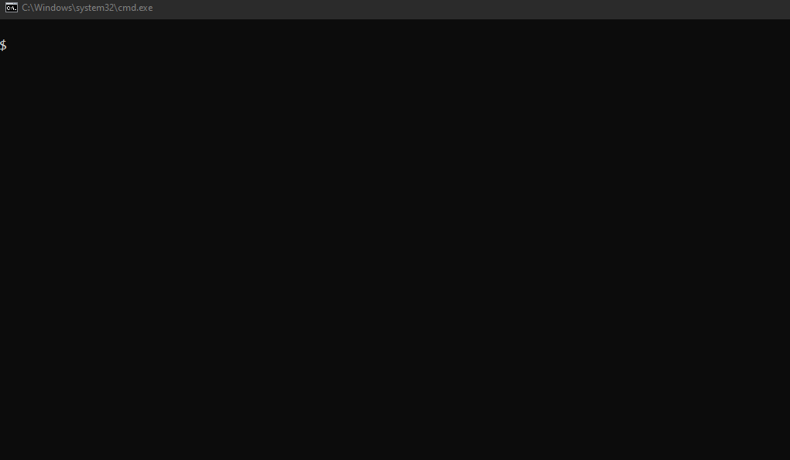
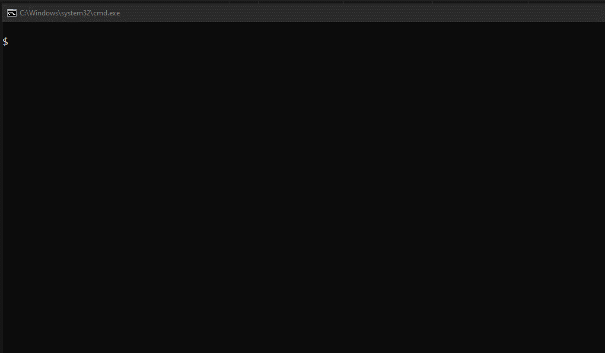

# Implementação do semáforo de transito com mudança de estados
## Autor: Luan Fellipe (allen08)

## Requisitos:
- NodeJS 16+

## Execução dos testes:
1. npm install 
2. npm test

## Execução da aplicação:
1. npm install (opcional se já tiver sido usado anteriormente para executar o teste)
2. npm run start

### [*] Execução dos testes:

### [*] Execução dos testes:

